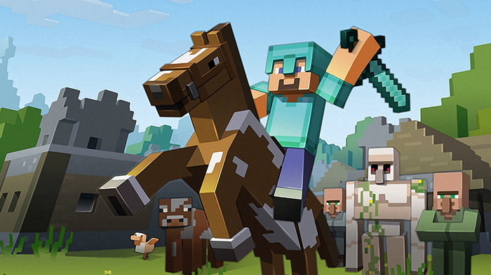

#  **** SCRAPE MY MINECRAFT -- MODS AND MORE.....****

## Looking to find more mods to add to your Minecraft worlds?

Look no further than here.... I've created an easy way to scrape the best mods from off the web and bring a quick synopsis of the mod to you.

Remember, Minecraft worlds are waiting for you to populate, create, modulate and formulate their existence.....WAIT NO LONGER!

Run your own server and bring these mods over or get connected with other people who creating worlds as advanced as yours.

_______________________________________________________________________________________
_______________________________________________________________________________________

## Table of Contents

- [About Scrape My Minecraft](#about-scrape-my-minecraft)
- [More info about creating the app](#creating-the app)
- [Install the app locally](#downloading-and-installing)
- [Improvements I'd like to make...](#improvements-id-like-to-make)

##  About Scrape My Minecraft

Scrape My Minecraft came about originally from a homework assignment that morphed into a way to help my son learn more about creating Minecraft worlds and programming his own mods.

I hope it will encourage others to continue the great fun and worlds created by the whole Minecraft experience.

##  Creating the App

Creating Scrape My Minecraft ......

##  Downloading and Installing

Should you choose to clone this app to your computer, here are the package dependecies you'll need to install.  (I use npm, but yarn should do the same things....)

    Run `npm init`. When that's finished, install and save these npm packages:
        1. express
        2. express-handlebars
        3. mongoose
        4. body-parser
        5. cheerio
        6. request

##  Improvements I'd like to make...

Here's the short list of things I'd like to incorporate sometime in the near future....

    --Deleting or hiding articles you no longer want to view
    --Allowing multiple users to leave notes for each other
    --Making the Web Portal more responsive, animated, and Minecraft-y :D